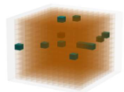

# pyHyperRom


## Overview
pyHyperRom is a Python-based framework for reduced-order modeling (ROM) and hyperreduction methods applied to computational mechanics and heat conduction problems. 

Large-scale simulations are essential in engineering fields such as fluid dynamics, structural analysis, reservoir modeling, and nuclear engineering, but their high computational cost poses a significant challenge. These systems, governed by nonlinear multi-physics equations, often exhibit an intrinsic low-dimensional structure, enabling the development of reduced-order models (ROMs) that approximate full-scale simulations with substantial speed-up. However, nonlinear ROMs can still be computationally expensive due to repeated evaluations of full-order nonlinear terms. This is because solving nonlinear equations typically requires iterative methods such as Newton-Raphson, which involve repeated projections of the full-order nonlinear terms onto the reduced space and lifting the reduced solutions back to the high-dimensional space. These operations negate much of the computational savings offered by ROMs, making hyper-reduction methods crucial. 

Hyper-reduction techniques, classified as approximate-then-project and project-then-approximate approaches, efficiently evaluate nonlinear terms while maintaining accuracy. Despite their growing significance, hyper-reduction methods are largely absent in commercial simulation tools, whereas open-source frameworks provide flexible implementations. pyHyperRom offers a structured repository for various hyper-reduction algorithms, serving as a practical resource for researchers and engineers looking to integrate these techniques into their computational workflows.

## Features
- **Reduced-Order Modeling (ROM):** Implements data-driven ROM techniques.
- **Hyperreduction Methods:** Includes ECM, DEIM, and ECSW-based approaches.
- **Heat Conduction Examples:** Demonstrates model reduction on 1D heat conduction problems.
- **Extensible Framework:** Modular codebase for easy integration with new models and methods.

## Installation
To set up the environment, use the provided `requirements.txt`:

```bash
pip install -r requirements.txt
```

## Example Usage
Navigate to:

```
examples → heat_conduction → OneD_heat_conduction → 1_ROM_Speedup_L_vs_NL_No_hyperreduction
```

The problem statements are available in the PDF. Then, use the linear and non-linear Jupyter notebooks to generate data using the linear and the nonlinear *Finite Element Models* respectively. While generating data for the linear FE model, make sure to uncomment the portion which corresponds to linear material property in the file:

```
examples → heat_conduction → OneD_heat_conduction → FEM_1D_system_properties
```
since by default the nonlinear material properties are used.


Once data generation is complete, proceed to:

```
examples → heat_conduction → OneD_heat_conduction → 2_Approximate_then_Project_Hyperreduction
```

In this folder, apply **DEIM** or **SOPT** to perform hyperreduction.

Alternatively, navigate to:

```
examples → heat_conduction → OneD_heat_conduction → 3_Project_then_Approximate_Hyperreduction
```

Here, use **ECM** or **ECSW** for hyperreduction.


## Directory Structure
```
pyHyperRom/
│── Resources/                           # Documentation and presentations
│── examples/                       # Example problems and notebooks
│── src/codes/                       # Core source code
│   ├── algorithms/                  # Hyperreduction algorithms
│   ├── prob_classes/                # Problem class definitions
│   ├── reductor/                    # Model reduction implementations
│   ├── utils/                        # Utility functions
requirements.txt                      # Dependencies
contributors.md                       # Contributors informaion
README.md                             # Project documentation
```

## Additional Notes

While this repository is not optimized for maximal efficiency, it is designed with a teaching and tutorial perspective in mind. The entire code structure remains simple and accessible, allowing researchers to follow the implementation easily and adapt it to their own codebases. This repository serves as a practical starting point for those looking to integrate hyper-reduction techniques into their computational workflows.

## Contributors
See the `contributors.md` file for a list of contributors.